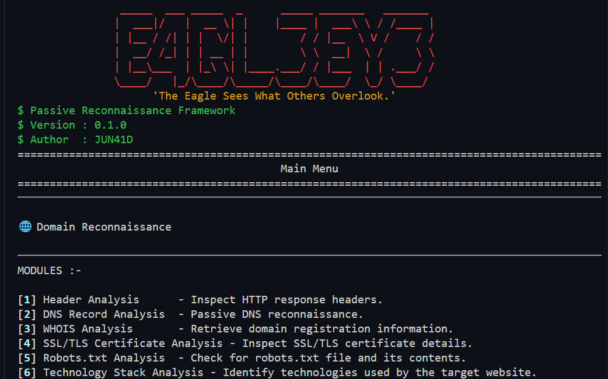
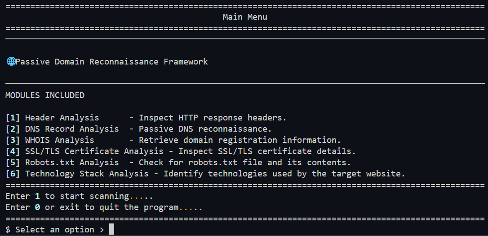

# 🦅 E4GL3EY3

> *"The Eagle Sees What Others Overlook."*

A terminal-based passive domain reconnaissance framework built with Python. It gathers publicly available information about a target domain to assist with reconnaissance and information gathering.



> **Disclaimer:** This tool is intended for educational purposes and authorized security assessments only.

---

## Features

- HTTP Header Analysis
- DNS Record Enumeration
- WHOIS Lookup
- robots.txt Analysis
- Technology Fingerprinting

---

## Installation

Clone the repository:

```bash
git clone https://github.com/<your-username>/E4GL3EY3.git
cd E4GL3EY3
```

Create a virtual environment:

```bash
python -m venv .venv
```

Activate the virtual environment:

**Windows**

```bash
.venv\Scripts\activate
```

**Linux / macOS**

```bash
source .venv/bin/activate
```

Install the required packages:

```bash
pip install -r requirements.txt
```

---

## Usage

Run the tool:

```bash
python main.py
```

Enter the target domain when prompted.



Example:

```text
Target Domain > example.com
```

---

## Modules

| Module | Description |
|---------|-------------|
| HTTP Header Analysis | Retrieves and displays HTTP response headers. |
| DNS Analysis | Enumerates common DNS records. |
| WHOIS Analysis | Retrieves public domain registration information. |
| robots.txt Analyzer | Downloads and displays the site's `robots.txt` file. |
| Technology Fingerprinting | Identifies common web technologies using passive indicators. |

---

## Project Structure

```text
E4GL3EY3/
│
├── main.py
├── requirements.txt
│
├── modules/
│   ├── headers.py
│   ├── dns.py
│   ├── whois.py
│   ├── robots.py
│   └── tech.py
│
└── utils/
    ├── banner.py
    └── menu.py
```

---

## Future Improvements

- Certificate Transparency Lookup
- Report Export (TXT / JSON)
- Improved Error Handling
- CLI Arguments
- Additional Technology Signatures

---

## License

This project is licensed under the MIT License.
